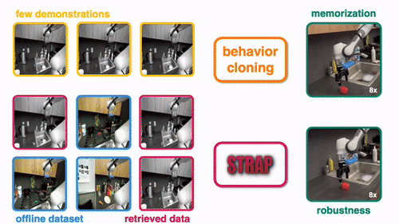

<p align="center">
  
</p>
<h1 align="center">Robot Sub-Trajectory Retrieval for Augmented Policy Learning</h1>

<p align="center"> 
  <a href="https://memmelma.github.io">Marius Memmel</a><sup>*</sup>, 
  <a href="https://www.linkedin.com/in/jacob-b-066234203/">Jacob Berg</a><sup>*</sup>, 
  <a href="https://scholar.google.com/citations?user=LYt_2MgAAAAJ&amp;hl=en">Bingqing Chen</a>, 
  <a href="https://abhishekunique.github.io/">Abhishek Gupta</a><sup>†</sup>, 
  <a href="https://scholar.google.com/citations?user=7CLS0LwAAAAJ&amp;hl=en">Jonathan Francis</a><sup>†</sup> 
</p>

<p align="center">*equal contribution †equal advising</p>

<p align="center">ICLR 2025</p>

<p align="center">
  <a href='https://openreview.net/pdf?id=EWfN9upi72'>paper</a> |
  <a href='https://arxiv.org/abs/2412.15182'>arxiv</a> |
  <a href='https://weirdlabuw.github.io/strap/'>website</a>

</p>

<p align="center"></p>

<p align="center">
  
</p>
<p align="center">STRAP is a retrieval robustifies few-shot imitation learning by encoding trajectories with vision foundation models and retrieving sub-trajectories with subsequence dynamic time warping.

</p>
<p align="center">This repository contains our implementation of the trajectory encoding and the retrieval algorithm.</p>

## Setup
1. Create the conda environment:
    ```bash
    conda create -n strap python=3.9
    conda activate strap
    ```
2. Install the repository:
    ```bash
    git clone https://github.com/WEIRDLabUW/STRAP.git
    cd STRAP/strap
    pip install -e .
    ```

You're all set!

Code tested with Python 3.9, PyTroch 2.0.1, transformers 4.46.4, and CUDA version 11.7

## Replicate LIBERO results
To replicate our results on the LIBERO datasets, first download the datasets using the `download_libero.py` script. 
```bash
python data/download_libero.py
```
Next, encode the datasets using `encode_datasets.py`. By default, the script encodes the `agentview_rgb` observations in LIBERO-10 and LIBERO-90 using DINOv2. This process can take up to multiple hours depending on your hardware!
```bash
python strap/embedding/encode_datasets.py
```

Finally run `retrieval.py` to retrieve sub-trajectories from the offline dataset. By default, the script selects 3 demos from the "put both moka pots on the stove" task in LIBERO-10 (prior dataset) and retrieves the top 100 sub-trajectories from LIBERO-90 (offline dataset). The sub-trajectories have a minimum length of 20 and are retrieved using the DINOv2 embeddings of `agentview_rgb`.
```bash
python strap/retrieval/retrieval.py
```

The retrieval dataset `put_both_moka_pots_retrieved_dataset.hdf5` is saved in the `data/retrieval_results` folder! You can now use this dataset to train a policy using our 
[policy learning code](test).

## Retrieve from custom datasets
We designed STRAP to be modular and deal with any dataset roughly following the [hdf5 structure](https://robomimic.github.io/docs/datasets/overview.html#dataset-structure) of robomimic.
The embedding code doesn't modify the original dataset and the retrieval algorithm writes a single hdf5 file containing the retrieved sub-trajectories.
To retrieve from a custom dataset, follow these steps:


1. Configure a new dataset

    To add a new dataset, create a `HDF5FileStructure` and two `DatasetConfig`.
    
    - `HDF5FileStructure` defines the file structure for the new dataset, e.g., which image observations and proprioceptive information to use, file paths and endings, and data keys.
    - `DatasetConfig` defines which files to load and helper functions to write the output dataset. You'll have to add two datasets (prior and offline).
    
    See [configs/libero_hdf5_config.py](strap/configs/libero_hdf5_config.py) for an example.

    **Tipp:** If you're dataset follows the LIBERO format you can reuse the helper functions in [configs/libero_file_functions.py](strap/configs/libero_file_functions.py).

    Configuration details: [here](strap/configs/README.md)

2. Embed the datasets

    Define encoders (`get_encoders`) and add the new dataset configs (`get_datasets`) in [embedding/encode_datasets.py](strap/embedding/encode_datasets.py).

    Run the script to embed the dataset:
    ```bash
    python strap/embedding/encode_datasets.py
    ```

    Configuration details: [here](strap/embedding/README.md)

3. Retrieve from the dataset

    Define the retrieval arguments (`get_args`) in [retrieval/retrieval.py](strap/retrieval/retrieval.py).

    Run the script to retrieve from the dataset:
    ```bash
    python strap/retrieval/retrieval.py
    ```

    Configuration details: [here](strap/retrieval/README.md)

## File Structure:
```bash
├── STRAP
│   ├── data/ # Folder to contain the data
│   │   ├── download_libero.py # Script to download libero datasets
│   ├── strap/
│   │   ├── retrieval/
│   │   │   ├── retrieval.py # Script to run retrieval on embeded datasets using the retrieval model
│   │   ├── embedding/
│   │   │   ├── encoders/
│   │   │   │   ├── encoders.py # Definitions of the different encoders
│   │   │   │   ├── encode_datasets.py # Script to encode a dataset using an encoder for retrieval.
│   │   │   ├── configs/
│   │   │   │   ├── libero_configs.py # Configs for the libero datasets
│   │   │   │   ├── libero_file_functions.py # File functions for the libero datasets
│   │   ├── README.md
│   ├── requirements.txt
```

## Citation
```aiignore
@article{memmel2024strap,
  title={STRAP: Robot Sub-Trajectory Retrieval for Augmented Policy Learning},
  author={Memmel, Marius and Berg, Jacob and Chen, Bingqing and Gupta, Abhishek and Francis, Jonathan},
  journal={arXiv preprint arXiv:2412.15182},
  year={2024}
}
```